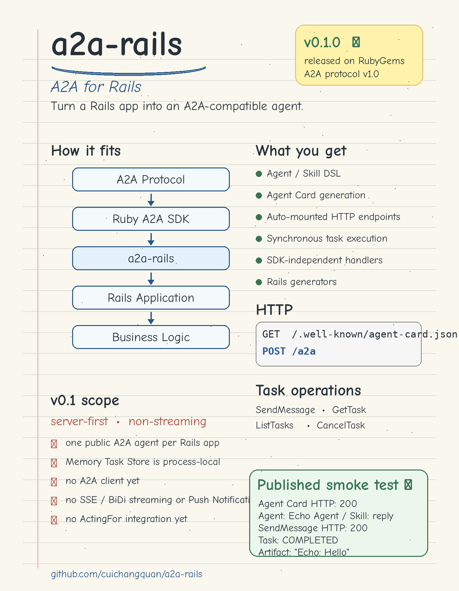
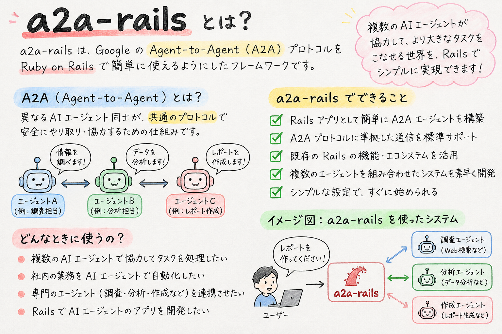

# a2a-rails

<br/>


Rails-native integration for exposing Rails applications as A2A v1.0 agents.

> **Status: v0.1.0 is released and available on RubyGems.**

- RubyGems: https://rubygems.org/gems/a2a-rails
- GitHub Release: https://github.com/cuichangquan/a2a-rails/releases/tag/v0.1.0
- Changelog: [CHANGELOG.md](CHANGELOG.md)
- Release record: [docs/release/v0.1.0-record.md](docs/release/v0.1.0-record.md)
- **Roadmap / 次にやること:** [ROADMAP.md](ROADMAP.md) — active Step 17 A2A TCK interoperability work.
- **Official A2A TCK results:** [JSON-RPC MUST report and reproduction guide](docs/testing/official-a2a-tck.md) — initial run: 56 passed / 9 failed; after Step 17-1 error fixes: **58 passed / 6 failed / 171 skipped** (pytest). **Not yet conformant.** The green workflow is informational, not proof of certification.

- [A2Aの全体像（日本語・A4 1枚PDF）](docs/guides/a2a-protocol-overview-ja.pdf) — 登場人物・依頼の流れ・主要用語・MCPとの違いをまとめた学習資料。
- [A2A at a glance (English, A4 one-page PDF)](docs/guides/a2a-protocol-overview-en.pdf) — Roles, workflow, key terms, and how MCP fits.

## What is a2a-rails?

`a2a-rails` lets a Rails application expose an A2A-compatible Agent without making application code depend directly on SDK-specific request and response objects.

```text
A2A Protocol
     ↓
Ruby A2A SDK
     ↓
a2a-rails
     ↓
Rails Application
     ↓
Business Logic
```

The Gem provides:

- a Rails-native Agent / Skill DSL;
- A2A Agent Card generation;
- automatically mounted A2A HTTP endpoints;
- synchronous Task execution;
- SDK-independent Handler inputs;
- a process-local Task Store;
- Rails generators for initial setup;
- an internal Protocol Adapter boundary around the upstream SDK.

v0.1 is intentionally **server-first** and **non-streaming**.

> [!WARNING]
> **Security / production use:** v0.1.0 does not provide built-in authentication or per-caller Task authorization. Do not expose `POST /a2a` to untrusted clients. Before public deployment, protect the endpoint at your application's or network's security boundary. Security hardening is tracked in [Issue #11](https://github.com/cuichangquan/a2a-rails/issues/11).

## Requirements

- Ruby `>= 3.3`
- Rails `>= 8.0, < 8.2`
- A2A protocol version `1.0`
- `agent2agent ~> 2.0.0`

The v0.1.0 release is verified against:

- Ruby 3.3 / 3.4 / 4.0
- Rails 8.0 / 8.1

## Installation

Add the Gem to an existing Rails application:

```bash
bundle add a2a-rails
```

Then generate the initializer and an Agent scaffold:

```bash
bin/rails generate a2a:rails:install
bin/rails generate a2a:rails:agent echo
```

No explicit Engine mount or host `config/routes.rb` change is required.

## Quick Start

The following Echo flow is verified against the published `a2a-rails 0.1.0` Gem in a clean Rails 8.1 application.

### 1. Generate the setup

```bash
bin/rails generate a2a:rails:install
bin/rails generate a2a:rails:agent echo
mkdir -p app/services/echo
```

The install generator creates:

```text
config/initializers/a2a_rails.rb
```

The Agent generator creates:

```text
app/agents/echo_agent.rb
```

The generators deliberately do not create application business logic, jobs, migrations, Task Stores, or routing side effects.

### 2. Create the Handler

Create `app/services/echo/reply.rb`:

```ruby
class Echo::Reply
  def self.call(message:, context:)
    text = message[:parts]
      .filter_map { |part| part[:text] }
      .join("\n")

    "Echo: #{text}"
  end
end
```

Handlers receive SDK-independent Ruby Hashes for `message` and `context`.

### 3. Define the Agent and Skill

Replace `app/agents/echo_agent.rb` with:

```ruby
class EchoAgent < A2A::Rails::Agent
  name "Echo Agent"
  description "Echo messages"
  version "1.0"

  skill :reply,
    description: "Echo a message",
    tags: %w[echo],
    handler: Echo::Reply
end
```

A single Skill is selected automatically. No Router is required.

### 4. Register the Agent

Replace `config/initializers/a2a_rails.rb` with:

```ruby
A2A::Rails.configure do |config|
  config.agent = "EchoAgent"
  config.public_base_url = ENV["A2A_PUBLIC_BASE_URL"]
end
```

For localhost, leave `A2A_PUBLIC_BASE_URL` unset or set it to `http://localhost:3000`.

The Agent class name remains a String until an A2A endpoint resolves it, preserving Rails autoload / reload behavior.

### 5. Check the Agent Card

Start Rails:

```bash
bin/rails server
```

Then request the Agent Card:

```bash
curl -sS http://localhost:3000/.well-known/agent-card.json \
  -H "A2A-Version: 1.0"
```

Expected essentials:

- HTTP 200
- Agent name `Echo Agent`
- Skill ID `reply`
- A2A interface URL ending in `/a2a`

### 6. Send a message

```bash
curl -sS -X POST http://localhost:3000/a2a \
  -H "Content-Type: application/json" \
  -H "A2A-Version: 1.0" \
  -d '{
    "jsonrpc": "2.0",
    "id": "1",
    "method": "SendMessage",
    "params": {
      "message": {
        "messageId": "msg-1",
        "role": "ROLE_USER",
        "parts": [{"text": "Hello"}]
      }
    }
  }'
```

A successful response reaches:

```text
result.task.status.state == TASK_STATE_COMPLETED
Artifact Text Part == "Echo: Hello"
```

See [docs/design/quick-start.md](docs/design/quick-start.md) for the design and verification notes behind this flow.

## Public Rails API

A minimal Agent looks like this:

```ruby
class ShoppingAgent < A2A::Rails::Agent
  name "Shopping Agent"
  description "Search and purchase products"
  version "1.0"

  skill :search_products,
    description: "Search products",
    tags: %w[shopping search],
    handler: Shopping::SearchProducts
end
```

Handler:

```ruby
class Shopping::SearchProducts
  def self.call(message:, context:)
    # Rails business logic
  end
end
```

Registration:

```ruby
A2A::Rails.configure do |config|
  config.agent = "ShoppingAgent"
  config.public_base_url = ENV["A2A_PUBLIC_BASE_URL"]
end
```

v0.1 targets **one public A2A Agent per Rails application**.

For multiple Skills, the application supplies a Router. The Router receives `skills:` as a frozen `Array<Symbol>` of declared Skill IDs and may return a matching Symbol or String. Unknown selections raise `A2A::Rails::UnknownSkillError`; the Dispatcher does not silently choose the first Skill.

## HTTP Endpoints

The Gem automatically exposes:

```text
GET  /.well-known/agent-card.json
POST /a2a
```

The Rails Engine is mounted automatically.

### Security work on main (unreleased; not in published v0.1.0)

The unreleased `main` branch includes a host-provided `config.authenticate_request` callback for `POST /a2a`, plus per-principal Task ownership checks. Without an authenticator, production and other non-development/test environments fail closed; the local development/test Quick Start remains available. See [Authentication guide](docs/guides/authentication.md).

> **Important:** These protections are **not yet shipped in RubyGems 0.1.0** and do not make an endpoint production-secure by themselves. Distributed rate limits, business authorization and the deployment review remain tracked in [Issue #11](https://github.com/cuichangquan/a2a-rails/issues/11).

### Step 16-4 request hardening (merged on main; unreleased)

The unreleased main branch adds a bounded JSON-RPC body (`config.max_request_bytes`, default 1 MiB), Content-Type validation, stricter parameter checks, a pagination snapshot cap, and reduced exception logging. See [Request Hardening Guide](docs/guides/request-hardening.md).

Rate limiting, application-specific authorization and production deployment safeguards remain the host's responsibility or future work. Step 16-5 adds explicit A2A Agent Card Bearer authentication advertisement on unreleased `main`; it must match the host verifier. **These improvements are not included in the published v0.1.0 Gem.**

### Production deployment review (Step 16-6)

**Current verdict: NO-GO for open public production using the default process-local MemoryStore.** A real host verifier, business-specific authorization, TLS/proxy restrictions, distributed rate limits, execution budgets, durable Task storage with quotas/retention, and deployment-specific verification are needed.

- [Production security & deployment guide](docs/guides/production-security.md) — responsibilities, sample configuration, security checks and current blockers.
- [Security release checklist](docs/release/security-hardening-release-checklist.md) — release/upgrade decision, acceptance criteria and artifact verification.

Do **not** interpret successful source-tree CI or a merge to `main` as publication of a new RubyGems release.


## Agent Card

Agent Cards are generated from the Agent / Skill DSL.

Behavior in v0.1:

- Skill IDs and default display names come from Skill declarations;
- optional `examples`, `input_modes`, and `output_modes` map to A2A Agent Card fields;
- Handler internals are not exposed;
- `public_base_url` wins when configured, otherwise the request base URL is used;
- default input/output mode is `text/plain`;
- Streaming, Push Notifications, and Extended Agent Cards are disabled;
- generated Cards pass the `agent2agent 2.0.0` Agent Card schema.

## Task Lifecycle

Internally, `a2a-rails` keeps SDK-independent Task states:

```text
SUBMITTED
    ↓
WORKING
    ├──→ COMPLETED
    ├──→ FAILED
    └──→ REJECTED
```

Cancellation can move a non-terminal Task to `CANCELED`.

Handler result mapping:

```text
normal return                  → COMPLETED
A2A::Rails::RejectedTask       → REJECTED
unexpected exception           → FAILED
```

Artifact mapping:

```text
String       → Text Part
Hash / Array → Data Part
nil          → no Artifact
other object → ArtifactMappingError

Unreleased Step 17-3 (not in RubyGems v0.1.0):
A2A::Rails::FileArtifact.bytes(...) → File Part with base64 raw bytes
A2A::Rails::FileArtifact.url(...)   → File Part with an HTTPS URL
```

**File Artifact output is unreleased.** Rails Handlers can explicitly return a `FileArtifact.bytes(data:, filename:, media_type:)` or `FileArtifact.url(url:, filename:, media_type:)`. See the [File Artifact output guide](docs/guides/file-artifacts.md). Input file Parts, downloading remote URLs and production file authorization are not supplied by the Gem.

Supported Task operations:

- `SendMessage`
- `GetTask`
- `ListTasks`
- `CancelTask`

`ListTasks` supports context/state/timestamp filters, stable newest-first ordering, page sizes 1–100, and opaque snapshot pagination.

The default `Task::MemoryStore` is thread-safe but process-local. Tasks and pagination cursors are not durable across process restarts and are not shared between processes.

Cancellation changes Task state atomically, but does not stop already-running Handler code or reverse application side effects.

## Architecture

Key boundaries:

- Rails Engine / controllers / routes form the Rails integration layer;
- SDK-specific behavior stays behind `Protocol::Adapter` / `Protocol::Agent2AgentAdapter`;
- A2A camelCase fields, `TASK_STATE_*`, SDK schema objects, and SDK errors stay in the Protocol layer;
- Agent / Handler application constants are resolved lazily through Rails;
- ActiveRecord and ActiveJob are not runtime requirements.

Gem structure:

```text
lib/a2a/rails/
├── agent.rb
├── skill.rb
├── dispatcher.rb
├── configuration.rb
├── runtime.rb
├── engine.rb
├── agent_card/
├── task/
└── protocol/

lib/generators/a2a/rails/
├── install_generator.rb
├── agent_generator.rb
└── templates/
```

## v0.1 Scope

Included:

- Rails integration
- `A2A::Rails::Agent`
- Skill DSL and Handler dispatch
- Agent Card generation
- `/.well-known/agent-card.json`
- `POST /a2a`
- synchronous Task lifecycle
- `SendMessage`, `GetTask`, `ListTasks`, `CancelTask`
- `A2A-Version: 1.0` validation
- in-memory Task Store
- Rails Engine / Routes
- Configuration
- `install` / `agent` generators
- Rails logging boundary

Not included in v0.1:

- A2A Client
- ActiveRecord Task Store
- ActiveJob Task execution
- SSE / BiDi Streaming
- Push Notifications
- gRPC
- Human-in-the-loop flows
- `INPUT_REQUIRED` / `AUTH_REQUIRED`
- OAuth Server
- Agent Registry / Marketplace
- Authorization Engine
- ActingFor integration
- Admin UI
- LLM Agent Framework
- Orchestration Framework

## Verification

The v0.1.0 release candidate completed:

```text
13 / 13 CI jobs green
70 tests
240 assertions
0 failures
0 errors
0 skips
```

After publication, `a2a-rails 0.1.0` was fetched back from RubyGems and its SHA256 matched the exact artifact that was pushed.

Final published artifact SHA256:

```text
23d34bde6f436723bf01735f3a507cf8529975b1dfed5d5da9b063fc0480b19f
```

A fresh Rails 8.1 application then installed the published Gem from RubyGems and verified:

```text
Agent Card HTTP: 200
Agent name: Echo Agent
Skill: reply
SendMessage HTTP: 200
Task state: TASK_STATE_COMPLETED
Artifact: Echo: Hello
```

See [docs/release/v0.1.0-record.md](docs/release/v0.1.0-record.md) for the complete release evidence.

## Test Strategy

v0.1 uses Minitest with four layers:

```text
4. Protocol E2E / Smoke Tests
3. Rails Integration Tests
2. Adapter Contract Tests
1. Core Unit Tests
```

The CI matrix covers:

- Gem: Ruby 3.3 / 3.4 / 4.0
- SDK spike: Ruby 3.3 / 3.4 / 4.0
- Rails: Ruby 3.3 / 3.4 / 4.0 × Rails 8.0 / 8.1
- Packaged Gem: Ruby 3.4 + clean Rails 8.1 application

Known warning-enabled output from upstream `agent2agent 2.0.0` can include circular-require, indentation, and URI-parser warnings. Those warnings are distinct from the Rack-environment INFO logging that `a2a-rails` suppresses at the Rails-facing adapter boundary.

## Release Documents

- [CHANGELOG](CHANGELOG.md)
- [v0.1.0 Release Notes](docs/release/v0.1.0.md)
- [v0.1.0 Release Checklist](docs/release/v0.1.0-checklist.md)
- [v0.1.0 Release Record](docs/release/v0.1.0-record.md)

## Design Documents

- [v0.1 Design Decisions](docs/design/v0.1-decisions.md)
- [v0.1 Test Strategy](docs/design/test-strategy.md)
- [v0.1 Gem Structure](docs/design/gem-structure.md)
- [v0.1 Quick Start Design](docs/design/quick-start.md)
- [SDK compatibility findings](docs/design/sdk-compatibility-spike.md)

## License

The Gem is available as open source under the terms of the MIT License. See [LICENSE](LICENSE).

## Official A2A Resources / A2A公式資料

- [A2A Protocol overview / A2Aの全体像（日本語・A4 1枚PDF）](docs/guides/a2a-protocol-overview-ja.pdf) — 公式資料をもとに作成した学習資料（2026-10-07）。
- [A2A at a glance (English, A4 one-page PDF)](docs/guides/a2a-protocol-overview-en.pdf) — Learning guide based on the official documentation (2026-10-07).
- [A2A Protocol documentation (Latest) / 公式ドキュメント](https://a2a-protocol.org/latest/)
- [A2A Protocol v1.0.0 documentation / v1.0.0ドキュメント](https://a2a-protocol.org/v1.0.0/)
- [A2A v1.0.0 Specification / v1.0.0仕様書](https://a2a-protocol.org/v1.0.0/specification/)
- [Official GitHub / 公式GitHub: a2aproject/A2A](https://github.com/a2aproject/A2A)
- [Official samples / 公式サンプル: a2aproject/a2a-samples](https://github.com/a2aproject/a2a-samples)

## Articles & Community / 紹介記事・コミュニティ

### Japanese articles / 日本語の紹介記事

- [Zenn: RailsアプリをA2A対応Agentとして公開する「a2a-rails」を作りました](https://zenn.dev/ccq/articles/d52c1b29982663)
- [Qiita: RailsアプリをA2A対応Agentとして公開する「a2a-rails」を作りました](https://qiita.com/ccq1170/items/0852445745403c8e848b)

### Community submissions / コミュニティへの投稿

- [awesome-a2a: Resource suggestion #190 / 掲載提案](https://github.com/ai-boost/awesome-a2a/issues/190)
