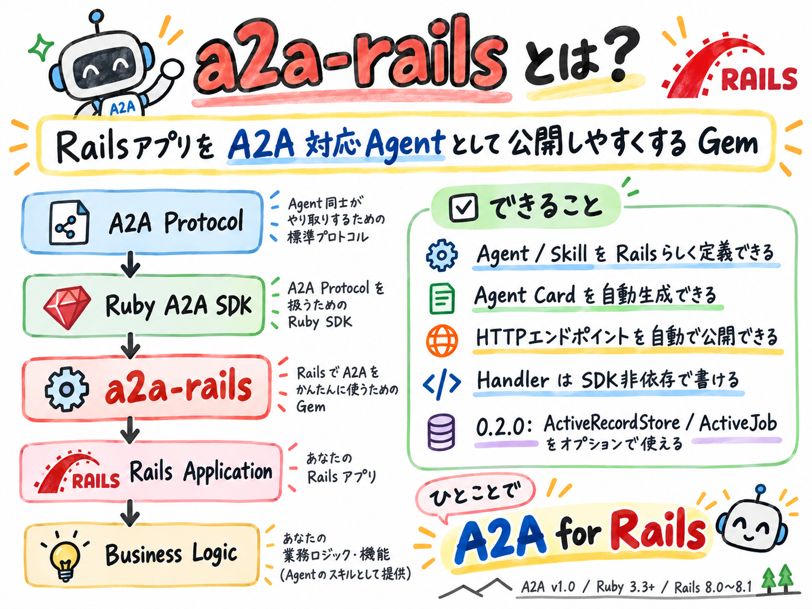
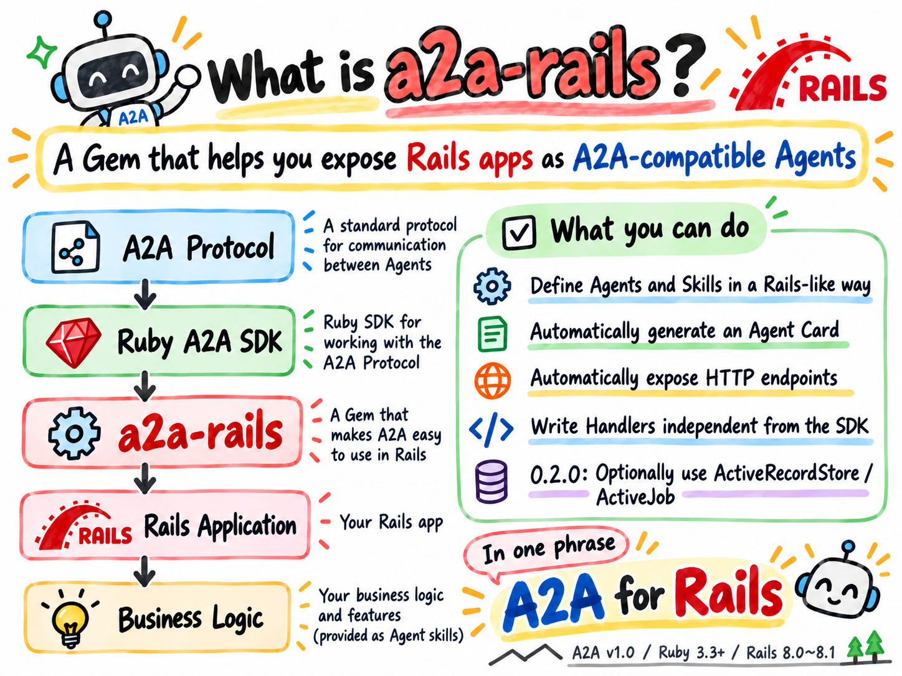

# a2a-rails

<br/>
<br/>


Rails-native integration for exposing Rails applications as A2A v1.0 agents.

> **New pre-release (2026-10-10):** `0.3.0.rc1` is published on [RubyGems](https://rubygems.org/gems/a2a-rails/versions/0.3.0.rc1) and as a [GitHub Pre-release](https://github.com/cuichangquan/a2a-rails/releases/tag/v0.3.0-rc1). It adds the outbound Rails Client and Client-only mode. Install with `gem install a2a-rails -v 0.3.0.rc1`, or pin `gem "a2a-rails", "0.3.0.rc1"` in your Gemfile. Stable `0.2.0` remains available. RC1 is not stable `0.3.0`, an independent audit, or public-production approval; see the [publication record](docs/release/v0.3.0-rc1-publication-record.md) and [Client guide](docs/guides/outbound-a2a-client.md).

> **Release status (2026-10-08):** **`0.2.0` is published as a stable release** on [RubyGems](https://rubygems.org/gems/a2a-rails/versions/0.2.0) and [GitHub](https://github.com/cuichangquan/a2a-rails/releases/tag/v0.2.0). It includes the Rails/Zeitwerk and migration-generator fixes after rc2. The public Gem matches the verified artifact byte-for-byte; see the [publication record](docs/release/v0.2.0-publication-record.md).

- RubyGems: https://rubygems.org/gems/a2a-rails
- Published stable release: https://github.com/cuichangquan/a2a-rails/releases/tag/v0.2.0
- Previous stable release: https://github.com/cuichangquan/a2a-rails/releases/tag/v0.1.0
- Changelog: [CHANGELOG.md](CHANGELOG.md)
- Release record: [v0.2.0 publication record](docs/release/v0.2.0-publication-record.md)
- **Security policy / 脆弱性報告:** [SECURITY.md](SECURITY.md) — confidential vulnerability reporting, current assurance boundaries and production responsibilities.
- **v0.3.x prerelease policy:** [Risk-based release gates](docs/release/step-29-5u-risk-based-oss-release-policy.md) — independently commissioned external audit is **recommended but optional**, not a known vulnerability or RubyGems requirement. Technical security checks, no known unresolved Critical/High findings, exact Gem provenance and explicit maintainer release approval remain mandatory; [optional community review #113](https://github.com/cuichangquan/a2a-rails/issues/113). **RC1 is published; stable 0.3.0 remains unreleased.**
- **Release readiness & upgrading:** [Step 31 stable-readiness tracker](docs/release/v0.3.0-stable-readiness.md) · [RC1 feedback snapshot](docs/release/v0.3.0-rc1-feedback-and-upgrade-readiness.md) · [v0.2.0 → planned v0.3.0 upgrade guide](docs/release/upgrading-v0.2.0-to-v0.3.md) · [v0.1.0 → v0.2.0 upgrade guide](docs/release/upgrading-v0.1.0-to-v0.2.md). **Stable 0.3.0 is not published.** Release and public deployment require separate approval.
- **Roadmap / 次にやること:** [ROADMAP.md](ROADMAP.md) · [Step 31 / Issue #120](https://github.com/cuichangquan/a2a-rails/issues/120) for planned stable `0.3.0` evaluation. [Issue #11](https://github.com/cuichangquan/a2a-rails/issues/11) still governs public-production deployment; the [historical `0.2.0` release record](docs/release/v0.2.0-stable-readiness.md) is separate.
- **Official A2A TCK results:** [Pinned JSON-RPC MUST report and reproduction](docs/testing/official-a2a-tck.md) — after Step 17-4: **63 passed / 1 failed / 171 skipped / 30 deselected** (pytest). The remaining `CORE-SEND-003` mismatch is tracked [upstream in #202](https://github.com/a2aproject/a2a-tck/issues/202). The TCK workflow is informational, **not** an A2A conformance certificate.

- [A2Aの全体像（日本語・A4 1枚PDF）](docs/guides/a2a-protocol-overview-ja.pdf) — 登場人物・依頼の流れ・主要用語・MCPとの違いをまとめた学習資料。
- [A2A at a glance (English, A4 one-page PDF)](docs/guides/a2a-protocol-overview-en.pdf) — Roles, workflow, key terms, and how MCP fits.

## Runnable Rails Demo / 実際に動くサンプル ⭐

**[a2a-rails-demo — independent Rails 8 Echo Agent](https://github.com/cuichangquan/a2a-rails-demo)**

Run a complete standalone Rails Agent using the **published RubyGems `a2a-rails = 0.2.0`** (not a Git source checkout). The separate Demo covers Agent Card discovery, JSON-RPC v1.0 SendMessage **Task and direct Message**, GetTask, ListTasks and error handling.

- [Demo Quick Start, code and example curl requests](https://github.com/cuichangquan/a2a-rails-demo#quick-start).
- [Demo GitHub Actions smoke](https://github.com/cuichangquan/a2a-rails-demo/actions/workflows/smoke.yml) — independent Rails 8.1.0 / Ruby 3.4.10 HTTP smoke **16/16 checks passed** against published Gem `0.2.0` ([Step 28 Demo PR #2, merged](https://github.com/cuichangquan/a2a-rails-demo/pull/2), [passing PR CI](https://github.com/cuichangquan/a2a-rails-demo/actions/runs/37736426834)). The CI also confirms `A2A::Rails::VERSION == "0.2.0"`, RubyGems as the dependency source, and the demo's production-startup refusal.
- **Local-only development/test** demo: no trusted verifier or durable Task store, **not** an internet-facing production template. See [production security](docs/guides/production-security.md).

### Outbound Client-only Rails Demo / 外部A2A Agentを呼び出すサンプル

**[a2a-rails-client-demo — standalone Rails 8 Client](https://github.com/cuichangquan/a2a-rails-client-demo)**

Independent Rails application using **published RubyGems `a2a-rails = 0.3.0.rc1`** with `server_enabled = false`. Demonstrates Agent Card discovery, SendMessage **Task or direct Message**, GetTask and ListTasks with exact HTTPS origin allowlisting. [Client-only CI PASS](https://github.com/cuichangquan/a2a-rails-client-demo/actions/runs/38048228531) and [independent Rails-to-Rails pinned-TLS CI PASS](https://github.com/cuichangquan/a2a-rails-client-demo/actions/runs/38048228488): the published RC1 Client calls an independently installed **published 0.2.0 Server** over real TLS using a **loopback-only test bridge and test-only pinned policy override**, including actual Echo business logic. This is **not** a public-DNS/public-CA, no-injection or production deployment test. The existing Server demo and shipped security policy remain unchanged; see [Step 30 #117](https://github.com/cuichangquan/a2a-rails/issues/117).


## What is a2a-rails?

`a2a-rails` lets a Rails application expose an A2A-compatible Agent without making application code depend directly on SDK-specific request and response objects.

```text
A2A Protocol
     ↓
Ruby A2A SDK
     ↓
a2a-rails
     ↓
Rails Application
     ↓
Business Logic
```

The Gem provides:

- a Rails-native Agent / Skill DSL;
- A2A Agent Card generation;
- automatically mounted A2A HTTP endpoints;
- synchronous Task execution by default, plus opt-in ActiveJob-backed async Task execution in published `0.2.0`;
- SDK-independent Handler inputs;
- a process-local MemoryStore by default, plus an optional durable ActiveRecordStore in `0.2.0`;
- Rails generators for initial setup;
- an internal Protocol Adapter boundary around the upstream SDK.

v0.1 is intentionally **server-first** and **non-streaming**.

> [!WARNING]
> **Versioned security note:** The original **v0.1.0** did not implement per-caller Task authorization. Published stable **0.2.0** (and prerelease **0.3.0.rc1**) include a host-owned authentication hook, principal-scoped Task operations and fail-closed non-development/test behavior. **Neither version supplies your identity provider or business authorization, and publication does not approve an anonymously exposed production endpoint.** See [SECURITY.md](SECURITY.md), [authentication guide](docs/guides/authentication.md) and [deployment #11](https://github.com/cuichangquan/a2a-rails/issues/11).

## Requirements

- Ruby `>= 3.3`
- Rails `>= 8.0, < 8.2`
- A2A protocol version `1.0`
- `agent2agent ~> 2.0.0`

The original v0.1.0 baseline was verified against:

- Ruby 3.3 / 3.4 / 4.0
- Rails 8.0 / 8.1

## Installation

Add the Gem to an existing Rails application:

```bash
bundle add a2a-rails
```

Then generate the initializer and an Agent scaffold:

```bash
bin/rails generate a2a:rails:install
bin/rails generate a2a:rails:agent echo
```

No explicit Engine mount or host `config/routes.rb` change is required.

## Quick Start

The following Echo flow is verified against the published `a2a-rails 0.1.0` Gem in a clean Rails 8.1 application.

### 1. Generate the setup

```bash
bin/rails generate a2a:rails:install
bin/rails generate a2a:rails:agent echo
mkdir -p app/services/echo
```

The install generator creates:

```text
config/initializers/a2a_rails.rb
```

The Agent generator creates:

```text
app/agents/echo_agent.rb
```

The generators deliberately do not create application business logic, jobs, migrations, Task Stores, or routing side effects.

### 2. Create the Handler

Create `app/services/echo/reply.rb`:

```ruby
class Echo::Reply
  def self.call(message:, context:)
    text = message[:parts]
      .filter_map { |part| part[:text] }
      .join("\n")

    "Echo: #{text}"
  end
end
```

Handlers receive SDK-independent Ruby Hashes for `message` and `context`.

### 3. Define the Agent and Skill

Replace `app/agents/echo_agent.rb` with:

```ruby
class EchoAgent < A2A::Rails::Agent
  name "Echo Agent"
  description "Echo messages"
  version "1.0"

  skill :reply,
    description: "Echo a message",
    tags: %w[echo],
    handler: Echo::Reply
end
```

A single Skill is selected automatically. No Router is required.

### 4. Register the Agent

Replace `config/initializers/a2a_rails.rb` with:

```ruby
A2A::Rails.configure do |config|
  config.agent = "EchoAgent"
  config.public_base_url = ENV["A2A_PUBLIC_BASE_URL"]
end
```

For localhost, leave `A2A_PUBLIC_BASE_URL` unset or set it to `http://localhost:3000`.

The Agent class name remains a String until an A2A endpoint resolves it, preserving Rails autoload / reload behavior.

### 5. Check the Agent Card

Start Rails:

```bash
bin/rails server
```

Then request the Agent Card:

```bash
curl -sS http://localhost:3000/.well-known/agent-card.json \
  -H "A2A-Version: 1.0"
```

Expected essentials:

- HTTP 200
- Agent name `Echo Agent`
- Skill ID `reply`
- A2A interface URL ending in `/a2a`

### 6. Send a message

```bash
curl -sS -X POST http://localhost:3000/a2a \
  -H "Content-Type: application/json" \
  -H "A2A-Version: 1.0" \
  -d '{
    "jsonrpc": "2.0",
    "id": "1",
    "method": "SendMessage",
    "params": {
      "message": {
        "messageId": "msg-1",
        "role": "ROLE_USER",
        "parts": [{"text": "Hello"}]
      }
    }
  }'
```

A successful response reaches:

```text
result.task.status.state == TASK_STATE_COMPLETED
Artifact Text Part == "Echo: Hello"
```

See [docs/design/quick-start.md](docs/design/quick-start.md) for the design and verification notes behind this flow.

## Public Rails API

A minimal Agent looks like this:

```ruby
class ShoppingAgent < A2A::Rails::Agent
  name "Shopping Agent"
  description "Search and purchase products"
  version "1.0"

  skill :search_products,
    description: "Search products",
    tags: %w[shopping search],
    handler: Shopping::SearchProducts
end
```

Handler:

```ruby
class Shopping::SearchProducts
  def self.call(message:, context:)
    # Rails business logic
  end
end
```

Registration:

```ruby
A2A::Rails.configure do |config|
  config.agent = "ShoppingAgent"
  config.public_base_url = ENV["A2A_PUBLIC_BASE_URL"]
end
```

v0.1 targets **one public A2A Agent per Rails application**.

For multiple Skills, the application supplies a Router. The Router receives `skills:` as a frozen `Array<Symbol>` of declared Skill IDs and may return a matching Symbol or String. Unknown selections raise `A2A::Rails::UnknownSkillError`; the Dispatcher does not silently choose the first Skill.

## HTTP Endpoints

The Gem automatically exposes:

```text
GET  /.well-known/agent-card.json
POST /a2a
```

The Rails Engine is mounted automatically.

### Security in v0.2.0 (not in v0.1.0)

Published `0.2.0` includes a host-provided `config.authenticate_request` callback for `POST /a2a`, plus per-principal Task ownership checks. Without an authenticator, production and other non-development/test environments fail closed; the local development/test Quick Start remains available. See [Authentication guide](docs/guides/authentication.md).

> **Important:** These protections are **absent from RubyGems 0.1.0** but included in the published `0.2.0.rc2` pre-release; stable `0.2.0` includes additional fixes. Neither pre-release nor stable source automatically makes a deployed endpoint production-secure. Distributed rate limits, business authorization and the deployment review remain tracked in [Issue #11](https://github.com/cuichangquan/a2a-rails/issues/11).

### Step 16-4 request hardening (included in v0.2.0)

Published `0.2.0` includes a bounded JSON-RPC body (`config.max_request_bytes`, default 1 MiB), Content-Type validation, stricter parameter checks, a pagination snapshot cap, and reduced exception logging. See [Request Hardening Guide](docs/guides/request-hardening.md).

Rate limiting, application-specific authorization and production deployment safeguards remain the host's responsibility or future work. Step 16-5 adds explicit A2A Agent Card Bearer authentication advertisement in published `0.2.0`; it must match the host verifier. **These improvements are not included in the published v0.1.0 Gem; see the published stable `0.2.0` release.**

### Production deployment review (Step 16-6)

**Current verdict: NO-GO by default for open public production.** The default MemoryStore remains process-local. Step 21 provides an optional durable ActiveRecordStore, and Step 22 provides optional ActiveJob Task execution, but production async operation requires **both** a shared/durable Task Store and a durable queue backend operated by the host. A real deployment must also provide credential verification, business authorization, TLS/proxy restrictions, distributed rate limits, execution budgets, observability and deployment-specific verification.

- [Production security & deployment guide](docs/guides/production-security.md) — responsibilities, sample configuration, security checks and current blockers.
- [Security release checklist](docs/release/security-hardening-release-checklist.md) — release/upgrade decision, acceptance criteria and artifact verification.

Do **not** interpret successful source-tree CI or a merge to `main` as publication of a new RubyGems release.


## Agent Card

Agent Cards are generated from the Agent / Skill DSL.

Behavior in v0.1:

- Skill IDs and default display names come from Skill declarations;
- optional `examples`, `input_modes`, and `output_modes` map to A2A Agent Card fields;
- Handler internals are not exposed;
- `public_base_url` wins when configured, otherwise the request base URL is used;
- default input/output mode is `text/plain`;
- Streaming, Push Notifications, and Extended Agent Cards are disabled;
- generated Cards pass the `agent2agent 2.0.0` Agent Card schema.

## Task Lifecycle

Internally, `a2a-rails` keeps SDK-independent Task states:

```text
SUBMITTED
    ↓
WORKING
    ├──→ COMPLETED
    ├──→ FAILED
    └──→ REJECTED
```

Cancellation can move a non-terminal Task to `CANCELED`.

Handler result mapping:

```text
normal return                  → COMPLETED
A2A::Rails::RejectedTask       → REJECTED
unexpected exception           → FAILED
```

Artifact mapping:

```text
String       → Text Part
Hash / Array → Data Part
nil          → no Artifact
other object → ArtifactMappingError

Included since v0.2.0 (not in v0.1.0):
A2A::Rails::FileArtifact.bytes(...) → File Part with base64 raw bytes
A2A::Rails::FileArtifact.url(...)   → File Part with an HTTPS URL
```

**File Artifact output is included in v0.2.0.** Rails Handlers can explicitly return a `FileArtifact.bytes(data:, filename:, media_type:)` or `FileArtifact.url(url:, filename:, media_type:)`. See the [File Artifact output guide](docs/guides/file-artifacts.md). Input file Parts, downloading remote URLs and production file authorization are not supplied by the Gem.

**Included in v0.2.0 (Step 17-4):** A2A v1.0 also permits a direct `Message` from `SendMessage`. The host Agent can opt into `response_mode :message` or select the mode using a callable; the default remains `:task`. Direct replies do **not** create Task records. See the [Direct Message response guide](docs/guides/direct-message-responses.md) for the contract and safety implications.

Supported Task operations:

- `SendMessage`
- `GetTask`
- `ListTasks`
- `CancelTask`

`ListTasks` supports context/state/timestamp filters, stable newest-first ordering, page sizes 1–100, and opaque snapshot pagination.

The default `Task::MemoryStore` is thread-safe but process-local. Tasks and pagination cursors are not durable across process restarts and are not shared between processes.

**Included in v0.2.0 (Step 21):** applications that need durable, multi-worker Task state can opt into `config.task_store = :active_record`. The ActiveRecordStore uses owner-scoped SQL access, row-locked transitions, signed keyset cursors, terminal retention, bounded pruning and maintenance limits. See [ActiveRecord Task Store](docs/guides/active-record-task-store.md). PostgreSQL 16 persistence/locking smoke is verified in CI.

**Included in v0.2.0 (Step 22):** Task execution remains synchronous by default. Hosts can opt into ActiveJob-backed async execution globally, per Agent, or per Skill; precedence is **Skill > Agent > global**.

```ruby
A2A::Rails.configure do |config|
  config.task_store = :active_record
  config.task_execution_mode = :async
end

class ReportsAgent < A2A::Rails::Agent
  execution_mode :sync

  skill :build_report,
    description: "Build a report",
    tags: %w[report],
    handler: Reports::Build,
    execution_mode: :async
end
```

Async `SendMessage` persists and returns a `SUBMITTED` Task, then a Gem-owned ActiveJob worker claims it atomically and executes the already-selected Skill. Direct-Message responses remain synchronous because they do not create a persisted Task to poll.

Production async use requires a shared/durable Task Store plus a durable ActiveJob backend. The Gem does not provide a distributed transaction between Task persistence and queue enqueue: a small crash window remains after Task commit and before queue acknowledgement. Generic Handler retries are intentionally disabled; duplicate Job delivery is suppressed at Task claim, but exactly-once external side effects are **not** guaranteed. Running cancellation is logical/best-effort, and ambiguous `WORKING` Tasks are not automatically replayed after a worker crash. See [ActiveJob Task Execution](docs/design/active-job-task-execution.md) and [queue adapter / HTTP async verification](docs/testing/queue-adapters.md).

Cancellation changes Task state atomically, but does not stop already-running Handler code or reverse application side effects.

## Architecture

Key boundaries:

- Rails Engine / controllers / routes form the Rails integration layer;
- SDK-specific behavior stays behind `Protocol::Adapter` / `Protocol::Agent2AgentAdapter`;
- A2A camelCase fields, `TASK_STATE_*`, SDK schema objects, and SDK errors stay in the Protocol layer;
- Agent / Handler application constants are resolved lazily through Rails;
- ActiveRecord is optional and loaded only when ActiveRecordStore is selected; ActiveJob is not a runtime requirement.

Gem structure:

```text
lib/a2a/rails/
├── agent.rb
├── skill.rb
├── dispatcher.rb
├── configuration.rb
├── runtime.rb
├── engine.rb
├── agent_card/
├── task/
└── protocol/

lib/generators/a2a/rails/
├── install_generator.rb
├── agent_generator.rb
└── templates/
```

## v0.1 Scope

Included:

- Rails integration
- `A2A::Rails::Agent`
- Skill DSL and Handler dispatch
- Agent Card generation
- `/.well-known/agent-card.json`
- `POST /a2a`
- synchronous Task lifecycle
- `SendMessage`, `GetTask`, `ListTasks`, `CancelTask`
- `A2A-Version: 1.0` validation
- in-memory Task Store
- Rails Engine / Routes
- Configuration
- `install` / `agent` generators
- Rails logging boundary

Not included in v0.1:

- A2A Client
- ActiveRecord Task Store
- ActiveJob Task execution
- SSE / BiDi Streaming
- Push Notifications
- gRPC
- Human-in-the-loop flows
- `INPUT_REQUIRED` / `AUTH_REQUIRED`
- OAuth Server
- Agent Registry / Marketplace
- Authorization Engine
- ActingFor integration
- Admin UI
- LLM Agent Framework
- Orchestration Framework

## Verification

The v0.1.0 release candidate completed:

```text
13 / 13 CI jobs green
70 tests
240 assertions
0 failures
0 errors
0 skips
```

After publication, `a2a-rails 0.1.0` was fetched back from RubyGems and its SHA256 matched the exact artifact that was pushed.

Final published artifact SHA256:

```text
23d34bde6f436723bf01735f3a507cf8529975b1dfed5d5da9b063fc0480b19f
```

A fresh Rails 8.1 application then installed the published Gem from RubyGems and verified:

```text
Agent Card HTTP: 200
Agent name: Echo Agent
Skill: reply
SendMessage HTTP: 200
Task state: TASK_STATE_COMPLETED
Artifact: Echo: Hello
```

See [docs/release/v0.1.0-record.md](docs/release/v0.1.0-record.md) for the complete release evidence.

## Cross-language A2A interoperability — source verification

[Step 18 / PR #27](https://github.com/cuichangquan/a2a-rails/pull/27) verified the **official** Python `a2a-sdk==1.2.2` and Go `a2a-go/v2 v2.6.0` clients against a loopback-only Rails JSON-RPC A2A v1.0 Agent. Both discovered Agent Cards, decoded Task and direct Message responses, queried Tasks and checked terminal cancellation and version errors.

- [Final official Python/Go interoperability CI](https://github.com/cuichangquan/a2a-rails/actions/runs/37576849497) — **both PASS**.
- [Final Ruby/Rails regression CI](https://github.com/cuichangquan/a2a-rails/actions/runs/37576849516) — **13/13 PASS**.
- [Interop test code, reproduction and limitations](docs/testing/cross-language-interop.md).

This evidence applies to the later source/pre-release line, not RubyGems v0.1.0; these tests do not certify full A2A interoperability or public-production safety.

## Test Strategy

v0.1 uses Minitest with four layers:

```text
4. Protocol E2E / Smoke Tests
3. Rails Integration Tests
2. Adapter Contract Tests
1. Core Unit Tests
```

The CI matrix covers:

- Gem: Ruby 3.3 / 3.4 / 4.0
- SDK spike: Ruby 3.3 / 3.4 / 4.0
- Rails: Ruby 3.3 / 3.4 / 4.0 × Rails 8.0 / 8.1
- Packaged Gem: Ruby 3.4 + clean Rails 8.1 application

Known warning-enabled output from upstream `agent2agent 2.0.0` can include circular-require, indentation, and URI-parser warnings. Those warnings are distinct from the Rack-environment INFO logging that `a2a-rails` suppresses at the Rails-facing adapter boundary.

## Release Documents

- [CHANGELOG](CHANGELOG.md)
- [Current 0.3.0 stable readiness (NOT released)](docs/release/v0.3.0-stable-readiness.md)
- [Step 31-4 RC1 feedback evidence and risks](docs/release/v0.3.0-rc1-feedback-and-upgrade-readiness.md)
- [Upgrading from v0.2.0 to planned v0.3.0](docs/release/upgrading-v0.2.0-to-v0.3.md)
- [RC1 feedback / bug report template](https://github.com/cuichangquan/a2a-rails/issues/new?template=rc1-feedback.md)
- [v0.1.0 Release Notes](docs/release/v0.1.0.md)
- [v0.1.0 Release Checklist](docs/release/v0.1.0-checklist.md)
- [v0.1.0 Release Record](docs/release/v0.1.0-record.md)

## Design Documents

- [v0.1 Design Decisions](docs/design/v0.1-decisions.md)
- [v0.1 Test Strategy](docs/design/test-strategy.md)
- [v0.1 Gem Structure](docs/design/gem-structure.md)
- [v0.1 Quick Start Design](docs/design/quick-start.md)
- [SDK compatibility findings](docs/design/sdk-compatibility-spike.md)

## License

The Gem is available as open source under the terms of the MIT License. See [LICENSE](LICENSE).

## Official A2A Resources / A2A公式資料

- [A2A Protocol overview / A2Aの全体像（日本語・A4 1枚PDF）](docs/guides/a2a-protocol-overview-ja.pdf) — 公式資料をもとに作成した学習資料（2026-10-07）。
- [A2A at a glance (English, A4 one-page PDF)](docs/guides/a2a-protocol-overview-en.pdf) — Learning guide based on the official documentation (2026-10-07).
- [A2A Protocol documentation (Latest) / 公式ドキュメント](https://a2a-protocol.org/latest/)
- [A2A Protocol v1.0.0 documentation / v1.0.0ドキュメント](https://a2a-protocol.org/v1.0.0/)
- [A2A v1.0.0 Specification / v1.0.0仕様書](https://a2a-protocol.org/v1.0.0/specification/)
- [Official GitHub / 公式GitHub: a2aproject/A2A](https://github.com/a2aproject/A2A)
- [Official samples / 公式サンプル: a2aproject/a2a-samples](https://github.com/a2aproject/a2a-samples)

## Articles & Community / 紹介記事・コミュニティ

### Japanese articles / 日本語の紹介記事

- [Zenn: RailsアプリをA2A対応Agentとして公開する「a2a-rails」を作りました](https://zenn.dev/ccq/articles/d52c1b29982663)
- [Qiita: RailsアプリをA2A対応Agentとして公開する「a2a-rails」を作りました](https://qiita.com/ccq1170/items/0852445745403c8e848b)

### Community submissions / コミュニティへの投稿

- [awesome-a2a: Resource suggestion #190 / 掲載提案](https://github.com/ai-boost/awesome-a2a/issues/190)
