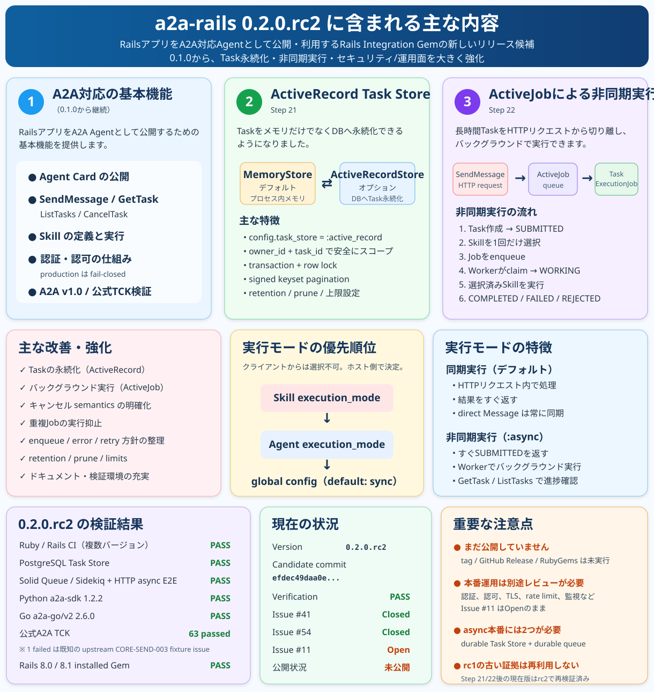

# a2a-rails 0.2.0.rc2 — Visual Overview

この資料は、**a2a-rails 0.2.0.rc2** に含まれる主な機能と検証状況を1枚で確認するためのビジュアル資料です。

主な内容:

- optional ActiveRecord Task Store
- optional ActiveJob async Task execution
- sync remains the default
- Skill > Agent > global の execution mode precedence
- production async requires a durable/shared Task Store + durable queue
- Ruby/Rails, PostgreSQL, Solid Queue/Sidekiq, HTTP async E2E, Python/Go interoperability, installed-artifact checks: PASS
- pinned official A2A TCK: 63 passed / 1 known upstream failure / 171 skipped / 30 deselected
- tag / GitHub Release / RubyGems publication: not performed
- deployment-specific security review: Issue #11 remains open

このファイルとSVGは `docs/` 配下だけに置いており、`a2a-rails.gemspec` の packaged file list には含まれません。
